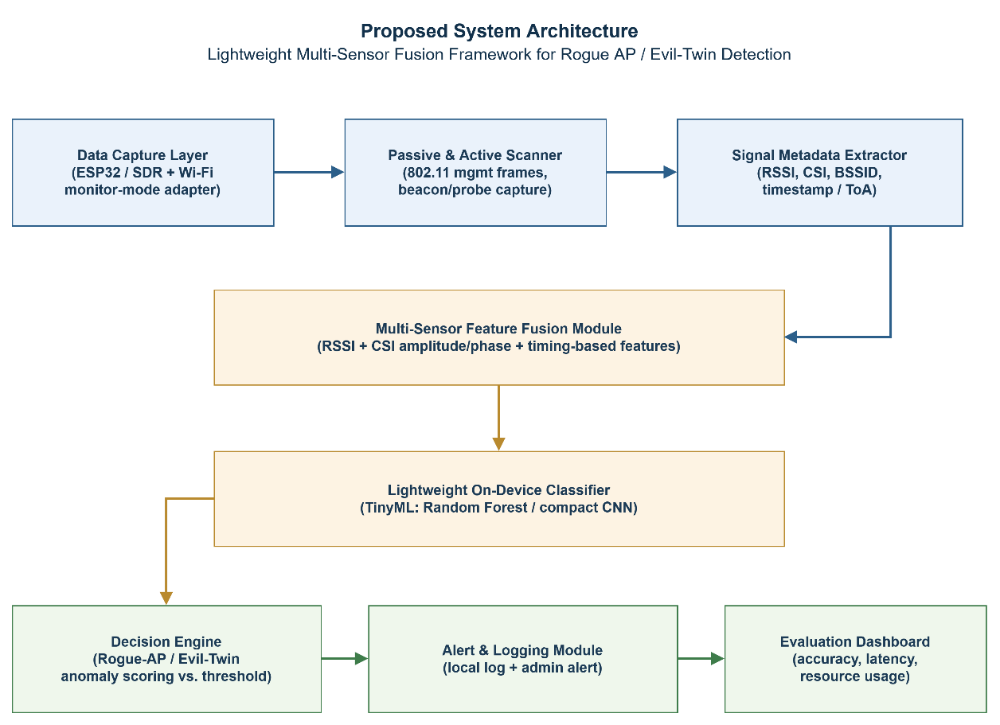
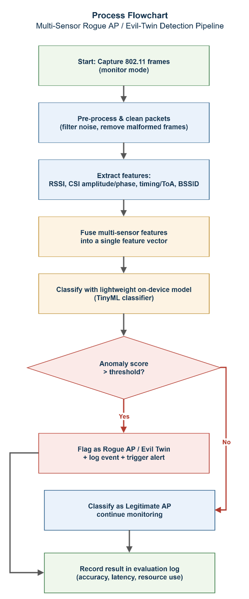

# System Architecture and Process Flowchart

### 1. Proposed System Architecture

The architecture is organised into four functional layers. The Data Capture Layer uses an ESP32-class microcontroller or software-defined radio (SDR) paired with a Wi-Fi adapter in monitor mode to passively and actively scan 802.11 management frames (beacons and probe responses). The Signal Metadata Extractor derives RSSI, CSI amplitude/phase, BSSID, and frame timestamp/time-of-arrival (ToA) information from each captured frame. 

These raw signals feed the Multi-Sensor Feature Fusion Module, which combines RSSI, CSI, and timing-based features into a single feature vector. The fused vector is passed to a Lightweight On-Device Classifier (a compact Random Forest or small CNN suited to TinyML deployment). Finally, the Decision Engine compares the classifier's anomaly score against a threshold to flag Rogue AP / Evil-Twin activity, the Alert & Logging Module records and reports the event, and the Evaluation Dashboard aggregates accuracy, latency, and resource-usage metrics.

---

### 2. Process Flowchart

The flowchart illustrates the operational flow of the proposed detection pipeline, from raw packet capture through to logged evaluation results. Captured 802.11 frames are first pre-processed to remove malformed or noisy packets. RSSI, CSI, timing, and BSSID features are then extracted and fused into a single vector, which is classified by the on-device TinyML model. 

If the resulting anomaly score exceeds the configured threshold, the access point is flagged as a Rogue AP / Evil-Twin, logged, and an alert is triggered; otherwise, the access point is classified as legitimate and monitoring continues. Every trial outcome whether flagged or not are recorded in the evaluation log.
